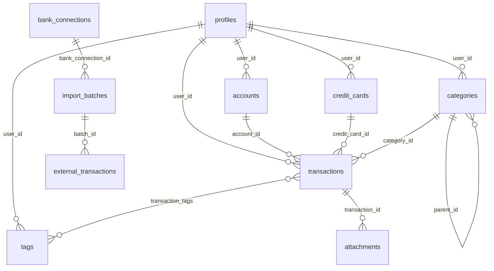

# Modelo de dados — PostgreSQL (Supabase)

Este documento descreve o **esquema relacional** do Open Ledger. Convenções: tabelas e colunas em `snake_case`; valores monetários em **BRL** como `numeric(12,2)` em **reais** (ex.: `99.90`). Ver também [functional-requirements.md](./functional-requirements.md).

---

## 1. Visão geral

- **SGBD**: PostgreSQL gerenciado pelo Supabase.
- **Multi-tenant**: isolamento por `user_id` referenciando `auth.users(id)`.
- **Segurança**: **RLS** em todas as tabelas de domínio listadas abaixo.
- **Arquivos**: metadados nas tabelas; binários no **Supabase Storage** (bucket privado).

---

## 2. Tipos enumerados (sugestão Postgres)

Criar tipos `enum` ou usar `text` com constraint `CHECK`; abaixo os valores semânticos.

| Nome conceitual   | Valores |
| ----------------- | ------- |
| `account_type`    | `checking`, `savings`, `cash`, `investment` |
| `transaction_type`| `income`, `expense`, `transfer` |
| `connection_status` | `pending`, `active`, `error`, `revoked` |
| `import_batch_status` | `running`, `completed`, `failed` |
| `external_tx_status` | `pending`, `merged`, `ignored`, `duplicate` |

---

## 3. Tabelas

### 3.1 `profiles`

Extensão do usuário autenticado (1:1 com `auth.users`).

| Coluna        | Tipo        | Restrições / notas |
| ------------- | ----------- | ------------------ |
| `id`          | `uuid`      | PK, FK → `auth.users(id)`, `ON DELETE CASCADE` |
| `display_name`| `text`      | opcional |
| `is_premium`  | `boolean`   | `NOT NULL DEFAULT false` |
| `created_at`  | `timestamptz` | `NOT NULL DEFAULT now()` |
| `updated_at`  | `timestamptz` | `NOT NULL DEFAULT now()` |

**Nota**: não há campo de moeda; o produto é **BRL** fixo.

---

### 3.2 `accounts`

| Coluna             | Tipo           | Restrições / notas |
| ------------------ | -------------- | ------------------ |
| `id`               | `uuid`         | PK, `gen_random_uuid()` |
| `user_id`          | `uuid`         | FK → `auth.users(id)`, `ON DELETE CASCADE` |
| `name`             | `text`         | `NOT NULL` |
| `type`             | `account_type` | `NOT NULL` |
| `institution`      | `text`         | opcional |
| `opening_balance`  | `numeric(12,2)`| `NOT NULL DEFAULT 0` |
| `notes`            | `text`         | opcional |
| `archived_at`      | `timestamptz`  | nullable; se não nulo, conta arquivada |
| `created_at`       | `timestamptz`  | `NOT NULL DEFAULT now()` |
| `updated_at`       | `timestamptz`  | `NOT NULL DEFAULT now()` |

**Saldo atual**: `opening_balance` + soma algébrica das transações vinculadas à conta (receitas/despesas e pernas de transferência — ver regra em `transactions`).

---

### 3.3 `credit_cards`

| Coluna          | Tipo           | Restrições / notas |
| --------------- | -------------- | ------------------ |
| `id`            | `uuid`         | PK |
| `user_id`       | `uuid`         | FK → `auth.users(id)`, `ON DELETE CASCADE` |
| `name`          | `text`         | `NOT NULL` |
| `credit_limit`  | `numeric(12,2)`| `NOT NULL`, `>= 0` |
| `closing_day`   | `smallint`     | `NOT NULL`, entre 1 e 31 |
| `due_day`       | `smallint`     | `NOT NULL`, entre 1 e 31 |
| `brand`         | `text`         | opcional |
| `institution`   | `text`         | opcional |
| `archived_at`   | `timestamptz`  | opcional |
| `created_at`    | `timestamptz`  | `NOT NULL DEFAULT now()` |
| `updated_at`    | `timestamptz`  | `NOT NULL DEFAULT now()` |

---

### 3.4 `credit_card_cycles` (opcional)

Materializa intervalos de fatura para consultas e cache. Pode ser omitido no MVP se o ciclo for **sempre calculado** só por data + `closing_day`.

| Coluna           | Tipo          | Restrições / notas |
| ---------------- | ------------- | ------------------ |
| `id`             | `uuid`        | PK |
| `credit_card_id` | `uuid`        | FK → `credit_cards(id)`, `ON DELETE CASCADE` |
| `period_start`   | `date`        | `NOT NULL` |
| `period_end`     | `date`        | `NOT NULL` |
| `created_at`     | `timestamptz` | `NOT NULL DEFAULT now()` |

Índice único sugerido: `(credit_card_id, period_start)`.

---

### 3.5 `categories`

| Coluna        | Tipo     | Restrições / notas |
| ------------- | -------- | ------------------ |
| `id`          | `uuid`   | PK |
| `user_id`     | `uuid`   | FK → `auth.users(id)`, `ON DELETE CASCADE` |
| `parent_id`   | `uuid`   | FK → `categories(id)`, `ON DELETE SET NULL` |
| `name`        | `text`   | `NOT NULL` |
| `sort_order`  | `int`    | `NOT NULL DEFAULT 0` |
| `archived_at` | `timestamptz` | opcional |
| `created_at`  | `timestamptz` | `NOT NULL DEFAULT now()` |
| `updated_at`  | `timestamptz` | `NOT NULL DEFAULT now()` |

Evitar ciclos na hierarquia (validar na aplicação ou trigger).

---

### 3.6 `tags`

| Coluna       | Tipo     | Restrições |
| ------------ | -------- | ---------- |
| `id`         | `uuid`   | PK |
| `user_id`    | `uuid`   | FK → `auth.users(id)`, `ON DELETE CASCADE` |
| `name`       | `text`   | `NOT NULL` |
| `created_at` | `timestamptz` | `NOT NULL DEFAULT now()` |

Constraint única sugerida: `(user_id, lower(name))` para evitar duplicatas case-insensitive.

---

### 3.7 `transaction_tags`

| Coluna           | Tipo   | Restrições |
| ---------------- | ------ | ---------- |
| `transaction_id` | `uuid` | FK → `transactions(id)`, `ON DELETE CASCADE` |
| `tag_id`         | `uuid` | FK → `tags(id)`, `ON DELETE CASCADE` |

PK composta: `(transaction_id, tag_id)`.

---

### 3.8 `transactions`

| Coluna                 | Tipo             | Restrições / notas |
| ---------------------- | ---------------- | ------------------ |
| `id`                   | `uuid`           | PK |
| `user_id`              | `uuid`           | FK → `auth.users(id)`, `ON DELETE CASCADE` |
| `type`                 | `transaction_type` | `NOT NULL` |
| `amount`               | `numeric(12,2)`  | `NOT NULL`, `> 0` |
| `occurred_at`          | `date`           | `NOT NULL` (data de competência) |
| `description`          | `text`           | opcional |
| `memo`                 | `text`           | opcional (notas internas) |
| `category_id`          | `uuid`           | FK → `categories(id)`, nullable |
| `account_id`           | `uuid`           | FK → `accounts(id)`, nullable |
| `credit_card_id`       | `uuid`           | FK → `credit_cards(id)`, nullable |
| `from_account_id`      | `uuid`           | FK → `accounts(id)`, nullable; preenchido se `type = transfer` |
| `to_account_id`        | `uuid`           | FK → `accounts(id)`, nullable |
| `parent_transaction_id`| `uuid`           | FK → `transactions(id)`, nullable; agrupa parcelas |
| `installment_index`    | `smallint`       | nullable; 1-based |
| `installment_total`    | `smallint`       | nullable |
| `is_recurring`         | `boolean`        | `NOT NULL DEFAULT false` (“gasto fixo” / recorrência lógica) |
| `recurrence_rule`      | `text`           | opcional; subseto ou ID de regra (futuro) |
| `created_at`           | `timestamptz`    | `NOT NULL DEFAULT now()` |
| `updated_at`           | `timestamptz`    | `NOT NULL DEFAULT now()` |

**Regras de consistência (validar na app ou com constraints)**:

- `type = income`: `account_id` obrigatório; `credit_card_id` nulo; `from_account_id`/`to_account_id` nulos.
- `type = expense`: ou `account_id` ou `credit_card_id` preenchido (não ambos obrigatórios vazios); transferências nulas.
- `type = transfer`: `from_account_id` e `to_account_id` obrigatórios e distintos; `amount` é o valor movido; `credit_card_id` nulo.

**Parcelamento**: todas as parcelas compartilham o mesmo `parent_transaction_id` (opcionalmente a “primeira” é a própria pai) ou apenas encadeamento por `parent_transaction_id` apontando para a compra original; documentar uma única convenção no código.

---

### 3.9 `transaction_installments` (opcional)

Se preferir normalizar parcelas em linhas separadas da “cabeça”:

| Coluna              | Tipo            | Notas |
| ------------------- | --------------- | ----- |
| `id`                | `uuid`          | PK |
| `root_transaction_id` | `uuid`        | FK → `transactions(id)` |
| `sequence`          | `smallint`      | 1..N |
| `due_date`          | `date`          | competência na fatura |
| `amount`            | `numeric(12,2)` | |
| `created_at`        | `timestamptz`   | |

Alternativa: apenas colunas em `transactions` (`installment_*`, `parent_transaction_id`) sem esta tabela. **Escolher um modelo** no MVP e manter.

---

### 3.10 `attachments`

| Coluna           | Tipo     | Restrições / notas |
| ---------------- | -------- | ------------------ |
| `id`             | `uuid`   | PK |
| `user_id`        | `uuid`   | FK → `auth.users(id)`, `ON DELETE CASCADE` |
| `transaction_id` | `uuid` | FK → `transactions(id)`, `ON DELETE CASCADE` |
| `storage_path`   | `text`   | `NOT NULL`, caminho no bucket |
| `file_name`      | `text`   | `NOT NULL` |
| `mime_type`      | `text`   | `NOT NULL` |
| `size_bytes`     | `bigint` | `NOT NULL`, `>= 0` |
| `created_at`     | `timestamptz` | `NOT NULL DEFAULT now()` |

---

### 3.11 Premium — `bank_connections`

| Coluna                  | Tipo                | Notas |
| ----------------------- | ------------------- | ----- |
| `id`                    | `uuid`              | PK |
| `user_id`               | `uuid`              | FK → `auth.users(id)`, `ON DELETE CASCADE` |
| `provider`              | `text`              | identificador do integrador |
| `status`                | `connection_status` | |
| `external_connection_id`| `text`              | id no provedor |
| `metadata`              | `jsonb`             | payload não estruturado documentado |
| `last_sync_at`          | `timestamptz`       | nullable |
| `created_at`            | `timestamptz`       | `NOT NULL DEFAULT now()` |
| `updated_at`            | `timestamptz`       | `NOT NULL DEFAULT now()` |

Segredos (tokens) **não** devem ficar em `metadata` acessível pelo cliente; usar backend seguro.

---

### 3.12 Premium — `import_batches`

| Coluna               | Tipo                  | Notas |
| -------------------- | --------------------- | ----- |
| `id`                 | `uuid`                | PK |
| `user_id`            | `uuid`                | FK |
| `bank_connection_id` | `uuid`                | FK → `bank_connections(id)`, `ON DELETE CASCADE` |
| `status`             | `import_batch_status` | |
| `started_at`         | `timestamptz`         | |
| `finished_at`        | `timestamptz`         | nullable |
| `error_message`      | `text`                | nullable |

---

### 3.13 Premium — `external_transactions`

Staging de movimentos importados.

| Coluna                 | Tipo                  | Notas |
| ---------------------- | --------------------- | ----- |
| `id`                   | `uuid`                | PK |
| `import_batch_id`      | `uuid`                | FK → `import_batches(id)`, `ON DELETE CASCADE` |
| `dedupe_key`           | `text`                | `NOT NULL`; único por usuário/lote conforme regra |
| `raw_payload`          | `jsonb`               | `NOT NULL` |
| `matched_transaction_id` | `uuid`              | FK → `transactions(id)`, nullable |
| `status`               | `external_tx_status`  | |
| `created_at`           | `timestamptz`         | `NOT NULL DEFAULT now()` |

---

## 4. Índices sugeridos

| Tabela          | Índice | Motivo |
| --------------- | ------ | ------ |
| `transactions`  | `(user_id, occurred_at DESC)` | listagens e filtros por período |
| `transactions`  | `(user_id, account_id, occurred_at)` | saldo por conta |
| `transactions`  | `(user_id, credit_card_id, occurred_at)` | faturas |
| `transactions`  | `(user_id, category_id)` | relatórios |
| `transactions`  | `(parent_transaction_id)` | parcelas |
| `categories`    | `(user_id, parent_id)` | árvore |
| `accounts`      | `(user_id)` onde `archived_at IS NULL` | partial index opcional |
| `attachments`   | `(transaction_id)` | anexos por lançamento |
| `external_transactions` | `(import_batch_id, status)` | processamento de lote |

---

## 5. Row Level Security (RLS)

Padrão para tabela `T` com coluna `user_id`:

- **`SELECT`**: `user_id = auth.uid()`
- **`INSERT`**: `user_id = auth.uid()`
- **`UPDATE`**: `user_id = auth.uid()` (e opcionalmente impedir troca de `user_id`)
- **`DELETE`**: `user_id = auth.uid()`

Tabelas com FK apenas via entidade pai (ex.: `external_transactions` via `import_batches.user_id`) devem usar políticas que façam join ou **coluna redundante `user_id`** para simplificar RLS (comum em designs Supabase).

`profiles`: políticas para `id = auth.uid()`.

---

## 6. Storage

- **Bucket** (ex.: `receipts`): **privado**.
- **Path**: `{user_id}/{transaction_id}/{uuid}_{file_name}`.
- Políticas: upload/read/delete apenas se `auth.uid()` corresponder ao prefixo `user_id` do path (implementação exata depende da função `storage.foldername` ou equivalente).

Limites de tamanho e MIME (`image/jpeg`, `image/png`, `application/pdf`, etc.) conforme [non-functional-requirements.md](./non-functional-requirements.md).

---

## 7. Mapeamento SQL ↔ TypeScript

Colunas `snake_case` no Postgres; propriedades `camelCase` no cliente, alinhadas a [`types/finance.entities.ts`](../types/finance.entities.ts). Campos `numeric(12,2)` podem ser representados como `string` no TypeScript para evitar erro de ponto flutuante, ou `number` se a stack fixar arredondamento na borda — **recomenda-se `string`** para valores monetários na camada de domínio.

---

## 8. Trigger `updated_at` (opcional)

Função genérica `set_updated_at()` em `BEFORE UPDATE` para tabelas com `updated_at`, padrão Supabase.
